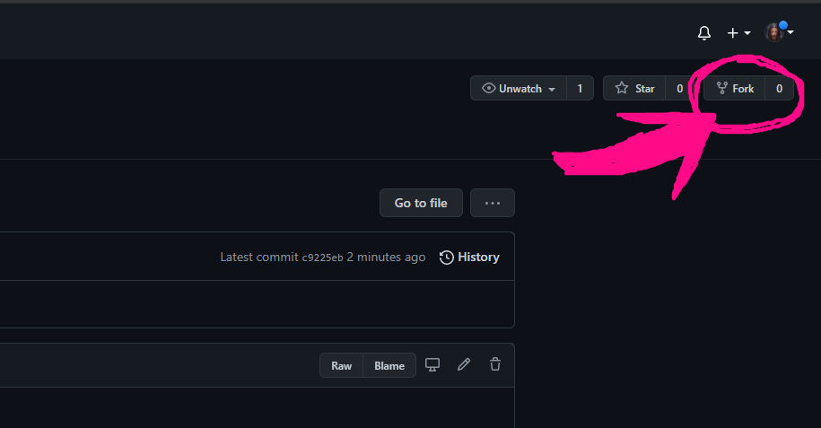
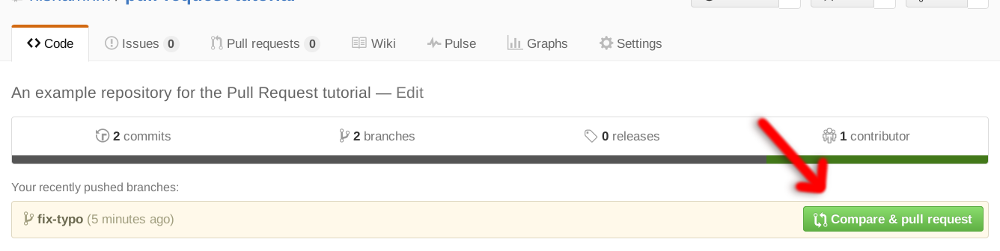

# 100DaysOfCode
<p align="center"> 
</p> 

## HI, 
###  **Welcome,**
<p> 
This repo is made to share my 100DaysOfCoding jounrney . Feel free to raise issue if any doubt. Happy Coding!
</p>

#

## Follow these steps to get the repository in your local _environment_
#


**1.** Fork [this](https://github.com/archismansaha/100DaysOfCode.git) repo.


 **2.** Clone repo:
 >The 'clone' command used to make an exact copy of the repository to your local machine.
 
 ```
 git clone https://github.com/archismansaha/100DaysOfCode.git 
 ```
**3.** Go to the repository folder:

```
cd 100DaysOfCode
```
**4.** Add a reference (remote) to the original repository:
> Setting a remote upstream and fetching it time to time makes sure your forked repo is in sync with the original repo.To set upstream(only use once):
```
git remote add upstream https://github.com/archismansaha/100DaysOfCode.git
```

**5.** Take a pull from the upstream main to make ypur repo up to date:
>To fetch(everytime you want to fetch run this):
```
git pull upstream main
```
**6.** Make new branch(change branch name as you want):
> In branch your changes doesnot affect production code . It's used to make production code bug free. And you should make branches when to do any changes in any code. 
```
git checkout -b <branch_name>
```
**7.** Now if you want to make any changes to code for making codes more efficient do it (make sure to raise an issue)
 >do comment beside your code why you add this changes

**7.** Now add your changes:

```
git add .
```

**8.** Commit changes:
>This 'commit' command save your  changes to local repository.

```
git commit -m "<relevant message to your change>"
```
**9.** Push changes(change branch_name to that which you made during creating branch):
>The 'push' command  syncs your commits to GitLab.
```
git push -u origin <branch_name>
```
**10.** To make pull request:

>Now click on `compare and pull requests`



## Don't forget to give it a star 
 
 </br>
Have a nice day. 

